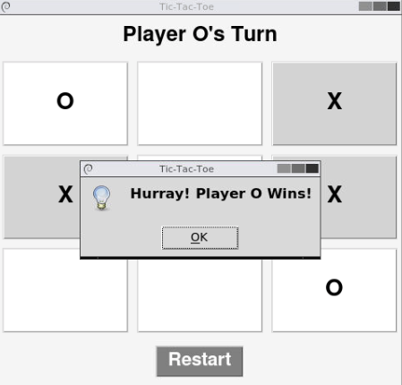

# Tic-Tac-Toe Game with Python

It’s a beginner-friendly project that helped me learn about GUI programming, event handling, and game logic in Python.

## Features

* **Graphical User Interface (GUI)** – Built with Tkinter for an interactive experience.
* **Two-Player Mode** – Play with a friend! The game automatically switches turns.
* **Winner Detection** – Checks for a winner or a tie after every move.
* **Restart Option** – Reset the board and start a new match easily.
* **Winning Animation** – The winning row flashes to highlight the victory.

## Technologies Used

* **Python** – Core programming language
* **Tkinter** – GUI framework for designing the game window

## What I Learned from This Project?

* Basics of Python programming
* How to create a GUI using Tkinter
* Handling button clicks and updating the interface dynamically
* Implementing game logic for checking winners
* Using global variables and event-driven programming
